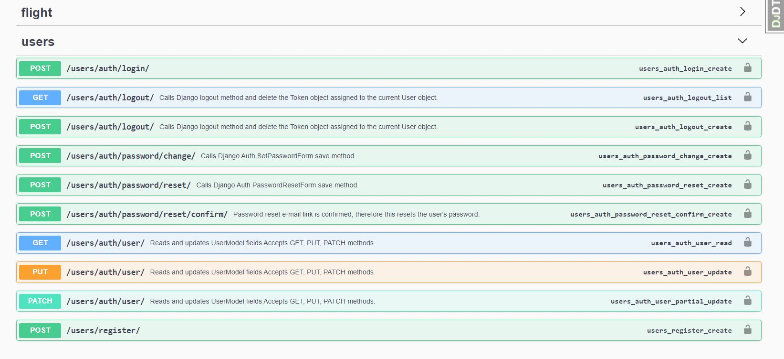
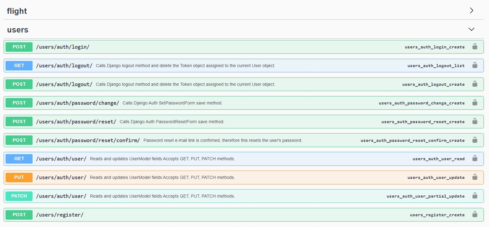

<h1 align="center">Flight Reservation App</h1>

<!-- TABLE OF CONTENTS -->

## Table of Contents

- [Overview](#overview)
- [Built With](#built-with)
- [Features](#features)
- [How to use](#how-to-use)
- [Acknowledgements](#acknowledgements)
- [Contact](#contact)

<!-- OVERVIEW -->

## Overview

### Built With

<!-- This section should list any major frameworks that you built your project using. Here are a few examples.-->

- Django

## How To Use

bash
# Clone this repository
$ git clone https://github.com/DMTBusra/FlightAppp.git

# Install dependencies
    $ python -m venv env
    > env/Scripts/activate (for win OS)
    $ source env/bin/activate (for macOs/linux OS)
    $ pip install -r requirements.txt

# Run the app
$ python manage.py runserver

## Acknowledgements

- Information for your projects

## Contact

- Email (gencbusra91@gmail.com)
- GitHub (https://github.com/DMTBusra)

- Linkedin (https://www.linkedin.com/in/busra-demet-930405217/)
